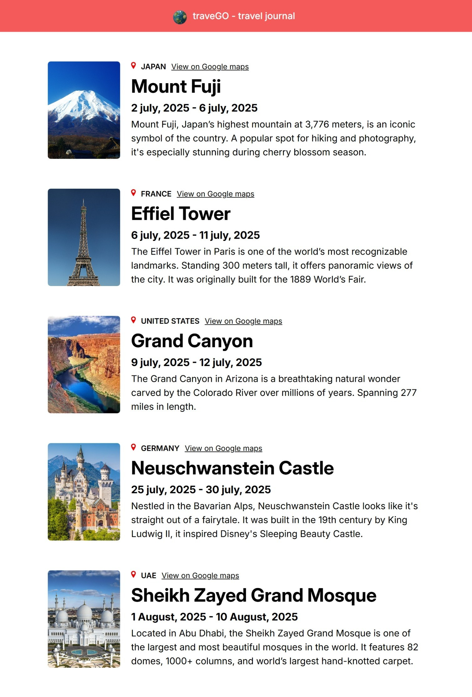

# 🌍 traveGO — Travel Journal

Welcome to **traveGO** — a simple, static travel journal built with **ReactJS** and **custom CSS**. It displays travel entries with essential information like place name, country, visit dates, a brief description, and a Google Maps link. This project is created for practicing how to **pass data through React props** in a clean and component-based setup.

---

## 📸 Preview



---

## 📱 Features

🗺️ Displays travel location, country, and visit dates  
📍 Google Maps link integration for each place  
🖼️ Location images with clean layout  
📝 Simple travel descriptions per entry  
🧭 Responsive design with static data rendering  

---

## 🧰 Tech Stack

| Technology   | Description                     |
|--------------|---------------------------------|
| `ReactJS`    | Component-based UI rendering & props handling |
| `CSS3`       | Styling and basic responsiveness |
| `Vite`       | Fast development server and build tool |

---

## 🗂️ Project Structure

```bash
📦 traveGO/
│
├── 📁 node_modules/                  # Project dependencies
│
├── 📁 public/
│   ├── 🌐 favicon.png               # Browser tab icon
│   ├── ⚛️ vite.svg                  # Vite logo asset
│   ├── 🖼️ preview.jpeg              # preview image
│
├── 📁 src/
│   ├── 📁 assets/
│   │   ├── 📁 places/
│   │   │   ├── 🖼️ img1.jpg         # Location images
│   │   │   ├── 🖼️ img2.jpg
│   │   │   ├── 🖼️ img3.webp
│   │   │   ├── 🖼️ img4.webp
│   │   │   └── 🖼️ img5.jpg
│   │   ├── 🖼️ globe.png             # Decorative asset
│   │   ├── 🖼️ location.png          # Location pin icon
│   │   └── ⚛️ react.svg             # React logo asset
│
│   ├── 📁 components/
│   │   ├── 🧩 Entry.jsx             # Component for each travel entry
│   │   └── 🧩 Header.jsx            # App header
│
│   ├── 🎨 App.css                   # App-level styles
│   ├── 📄 App.jsx                   # Root component
│   ├── 🎨 index.css                 # Global styles
│   ├── ⚛️ main.jsx                  # App entry point
│   └── 📄 touristPlaces.js          # Static travel data array
│
├── ⚙️ .gitignore                    # Files to exclude from Git
├── 📄 eslint.config.js             # Linting rules
├── 📄 index.html                   # HTML entry point
├── 📄 package.json                 # Project metadata & scripts
├── 📄 package-lock.json            # Dependency lockfile
├── 📄 vite.config.js               # Vite configuration
└── 📄 README.md                    # You're reading it!
```
